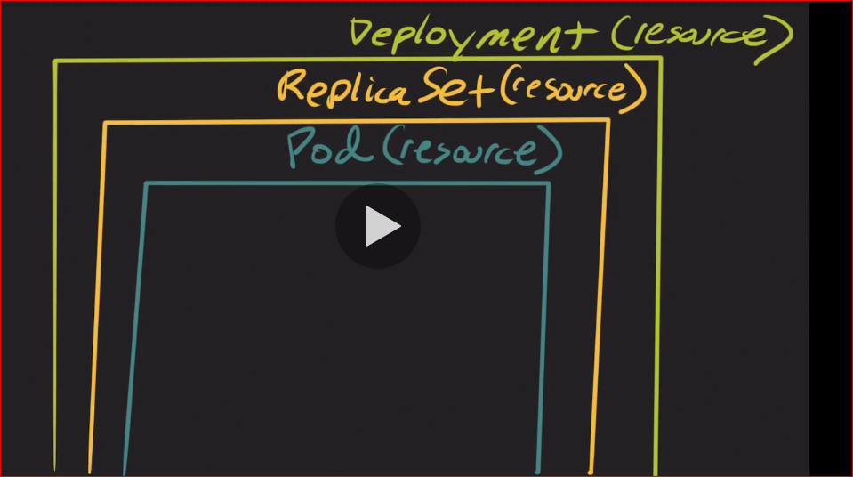

# Deployments

https://blog.container-solutions.com/kubernetes-deployment-strategies
https://kubernetes.io/docs/concepts/workloads/controllers/deployment/

Deployments provide declarative updates for pods and replica sets. You can easily achieve the following functionality using deployment:

* Start a replication controller or replica set.
* Check the status of deployment.
* Update deployment to use a new image, without any outages.
* Roll back deployment to an earlier revision.

Basic commands:

* How to check if something exists: `kubectl get all`
* Create a deployment: `kubectl create -f deployment_file.yaml`
* Check status deployment: `kubectl rollout status deployment/my-app` - rollout is the process to create a deployment in the back end.
* Show revisions per deployment: `kubectl rollout history deployment/my-app`
* Delete a deployment: `kubectl delete deployment deployment/my-app`
* Create a deployment with track of the changes: `kubectl create -f deployment_file.yaml --record`
* How to update the version of a container in a deployment. We can do:

1. Change the version inside of the deployment file for the specific container
2. Run the command: `kubectl set image deployment/my-app nginx-container=nginx:1.12-perl`

* Rollback a change: `kubectl rollout undo deployment/my-app`
  
  

## 1. We have deployed a simple web application. Inspect the PODs and the Services

```
kubectl get services
kubectl get service webapp-service
kubectl describe service webapp-service
kubectl get pods -o wide
```

## 2. Inspect the deployment and identify the number of PODs deployed by it

```
kubectl get deployments
kubectl get deployment frontend
```

## 3. What container image is used to deploy the applications?

`kubectl get deployment frontend -o yaml > output.yaml`

## 4. Types of deploymeny

* **Recreate**: Terminate the old version and release the new one. A deployment defined with a strategy of tpye `recreate` will terminate all the running instances then recreate them with the new version.
* **Ramped - slow rollout**: Release a new version on a rolling update fashion, one after the other. A rampled deployment updates pods in a rolling update fashion, a secondary Replicaset is created with the new version of the Application, then the number of replicas old the old version is decreased and the new version is increased until the correct number of replicas is reached.
* blue/green: release a new version alognside the old version then swith the traffic. Differs from a ramped deployment because the green version of the application is deployed alongside the blue version. After testing that the new version meets the requeriments, we update the kubernetes service object  that plays the role of load balancer to send the traffic to the new version by replacing the version label in the selector field.
* canary: release a new version to a subset of users, then proceed to a full rollout
* a/b testing: release a version to a subset of users in a precise way

## 5. Let us try that. Upgrade the application by setting the image on the deployment to 'kodekloud/webapp-color:v2' Do not delete and re-create the deployment. Only set the new image name for the existing deployment.

* Deployment Name: frontend
* Deployment Image: kodekloud/webapp-color:v2

```
kubectl edit deployment frontend
```
Change container to `kodekloud/webapp-color:v2`

## 6. Change the deployment strategy to 'Recreate' Do not delete and re-create the deployment. Only update the strategy type for the existing deployment.

* Deployment Name: frontend
* Deployment Image: kodekloud/webapp-color:v2
* Strategy: Recreate

```
kubectl edit deployment frontend
```

Replace this part of the definition 

```
strategy:
  rollingUpdate:
    maxSurge: 25%
    maxUnavailable: 25%
  type: RollingUpdate
```

for this one:

```
strategy:
  type: Recreate
```

## 7. Upgrade the application by setting the image on the deployment to 'kodekloud/webapp-color:v3' Do not delete and re-create the deployment. Only set the new image name for the existing deployment.

* Deployment Name: frontend
* Deployment Image: kodekloud/webapp-color:v3

```
kubectl edit deployment frontend
```

Change container to `kodekloud/webapp-color:v2`